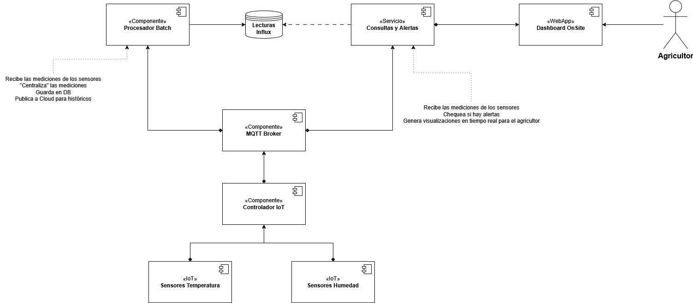

# IoT Batch Processor Service

This service acts as a component in an agricultural IoT system. Its primary responsibilities are:

1.  **Subscribe** to sensor data messages published on an MQTT broker.
2.  **Attempt to Forward** the received data to an Apache Kafka topic (typically for cloud ingestion/long-term storage).
3.  **Store** the data reliably in an InfluxDB database, configured with a **2-day retention period**, serving as a short-term buffer and local historical view.

Built with Java, Maven, Paho MQTT, InfluxDB Client, and Kafka Clients.

## Architecture Context

This service consumes data published by IoT devices (or simulators like the `iot-sensor-publisher`) via an MQTT broker. It then buffers this data locally in InfluxDB for 2 days and attempts to push it to Kafka for further processing or cloud storage. It does not directly serve user queries or dashboards.



## Features

* Subscribes to configurable MQTT topic filters (e.g., `sensors/#`).
* Deserializes JSON sensor data messages.
* Publishes received messages asynchronously to a configured Kafka topic.
* Writes sensor data points (tags: `sensorId`, `location`, `originTopic`; field: `value`) to a configured InfluxDB v2 bucket.
* Relies on InfluxDB's bucket retention policy for automatic data cleanup (configured externally).
* Uses SLF4J for logging.
* Loads configuration from environment variables or a `.env` file.
* Includes graceful shutdown handling.

## Prerequisites

Before you begin, ensure you have the following installed:

* **Java Development Kit (JDK):** Version 17 or later (Check `pom.xml`).
* **Apache Maven:** Version 3.6+ recommended.
* **Docker & Docker Compose:** Recommended for running dependencies (MQTT, Kafka, InfluxDB) locally.
* **Running MQTT Broker:** Accessible to this service (e.g., Mosquitto).
* **Running Apache Kafka Cluster:** Accessible to this service.
* **Running InfluxDB v2.x Instance:** Accessible to this service.

## Setup and Configuration

**1. Clone the Repository**
```bash
 git clone https://github.com/TG-Cannabis/Bash_Processor.git
 cd Bash_Processor
```

**2. Set up Dependencies (InfluxDB & Kafka via Docker Compose - Recommended)**

This project requires running instances of InfluxDB and Kafka. An example `docker-compose-dependencies.yml` file may be provided in the repository to start them easily:

```bash
 docker-compose -f docker-compose-dependencies.yml up -d
```
*(Refer to the specific `docker-compose-dependencies.yml` file for details on ports and default settings).* Wait a minute or two for the services to fully initialize, especially Kafka. If a compose file is not provided, ensure you have Kafka and InfluxDB running and accessible.

**3. Configure InfluxDB Instance**

You **must** configure your InfluxDB instance *before* running the application:

* **Access InfluxDB UI:** Typically running at `http://localhost:8086` if using Docker Compose from the example. Complete the initial setup (create user, password, org, initial bucket - e.g., name the bucket `iot_sensordata`).
* **Create Bucket:** Ensure the target bucket exists (e.g., `iot_sensordata`).
* **Set Retention Policy (CRITICAL):**
    * Navigate to your bucket settings in the InfluxDB UI (Load Data -> Buckets -> Click on your bucket name).
    * Set the **Retention Period** to **2 days** (or `48h`). This is crucial for the requirement. Save the changes. InfluxDB will now automatically delete data older than this period from this bucket.
    * *Alternatively, using Influx CLI v2:* `influx bucket update --id <your-bucket-id> --retention 48h` (find bucket ID with `influx bucket list`).
* **Create API Token:**
    * Navigate to Load Data -> API Tokens in the UI.
    * Generate a new API Token.
    * Grant it **Write** permissions scoped *only* to the specific bucket you created (e.g., `iot_sensordata`).
    * Copy the generated token securely – you will need it for the `.env` file.

**4. Configure Kafka**

* Ensure your Kafka broker(s) are running (e.g., at `localhost:9092` if using the example Docker Compose).
* The Kafka topic specified in the `.env` file (e.g., `sensores_cloud`) needs to exist on the broker. Your Kafka broker might be configured for auto-topic creation (common in development setups), otherwise, you may need to create it manually using Kafka command-line tools (e.g., `kafka-topics.sh --create ...`).

**5. Configure Application (`.env` file)**

* Copy the example environment file `src/main/resources/.env.example` to `src/main/resources/.env`:
    ```bash
    cp src/main/resources/.env.example src/main/resources/.env
    ```
* **Edit `src/main/resources/.env`** and fill in the correct values for your environment:
    * `MQTT_BROKER`: Address of your running MQTT broker (e.g., `tcp://localhost:1883`).
    * `MQTT_CLIENT_ID`: (Optional) Unique ID for this service instance.
    * `MQTT_TOPIC_FILTER`: MQTT topic(s) to subscribe to (e.g., `sensors/#`).
    * `INFLUX_URL`: URL of your InfluxDB instance (e.g., `http://localhost:8086`).
    * `INFLUX_TOKEN`: The InfluxDB API token you created (with write access).
    * `INFLUX_ORG`: Your InfluxDB organization name/ID.
    * `INFLUX_BUCKET`: The name of the InfluxDB bucket (which has the 2-day retention policy set).
    * `KAFKA_BROKERS`: Comma-separated list of Kafka broker addresses (e.g., `localhost:9092`).
    * `KAFKA_TOPIC`: The Kafka topic to publish data to (e.g., `sensores_cloud`).
    * `KAFKA_CLIENT_ID`: (Optional) Client ID for the Kafka producer.

## Building the Project

Use Apache Maven to compile and package the application into an executable JAR file:

```bash
  mvn clean package
```
The resulting JAR file (e.g., `iot-batch-processor-1.0.0.jar`) will be created in the `target/` directory.

## Running the Application

Ensure your MQTT broker, Kafka cluster, and InfluxDB instance are running and correctly configured as per the previous steps.

* **Run from JAR:**
    ```bash
    java -jar target/iot-batch-processor-1.0.0.jar
    ```
  *(Adjust JAR filename based on the artifactId and version in `pom.xml`)*

* **Run from IDE:**
    * Import the project into your IDE as a Maven project.
    * Ensure the `.env` file is present in `src/main/resources`.
    * Run the `main` method in the `com.yourcompany.batchprocessor.app.BatchProcessorApplication` class.

The application will start, connect to the configured services (MQTT, Kafka, InfluxDB), subscribe to MQTT topics, and begin processing messages. Check the console output for logs.

## Project Structure

The project follows a standard Maven layout, with code organized by feature/layer:

```
.
├── pom.xml                 # Maven Configuration
├── README.md               # This file
├── LICENSE                 # Your chosen license file (e.g., MIT)
├── docker-compose-dependencies.yml # Example for running Kafka & InfluxDB (if provided)
├── src
│   ├── main
│   │   ├── java
│   │   │   └── com/yourcompany/batchprocessor/ # Base package
│   │   │       ├── app/        # Main application class
│   │   │       ├── config/     # Configuration loading (BatchProcessorConfig)
│   │   │       ├── influx/     # InfluxDB interaction (InfluxDbService)
│   │   │       ├── kafka/      # Kafka interaction (KafkaService)
│   │   │       ├── model/      # Data models (SensorData, SensorInformation)
│   │   │       ├── mqtt/       # MQTT interaction (MqttService)
│   │   │       └── processing/ # Message handling logic (SensorDataHandler)
│   │   └── resources
│   │       ├── .env.example    # Example environment config
│   │       ├── .env            # Your actual environment config (NEEDS CREATION)
│   │       └── simplelogger.properties # Example logging configuration
│   └── test/                   # Unit/Integration tests (TODO)
└── target/                   # Build output (JAR file, classes, etc.)
```

## Logging

The application uses SLF4J for logging. A basic configuration for `slf4j-simple` is provided in `src/main/resources/simplelogger.properties`. You can adjust log levels in this file for debugging or replace `slf4j-simple` with a more advanced logging framework like Logback or Log4j2 by updating the `pom.xml` and providing the corresponding configuration file.

## Troubleshooting

* **Connection Errors (MQTT/Kafka/InfluxDB):**
    * Verify service addresses, ports, tokens, orgs, buckets, topics in your `.env` file are correct and match your running services.
    * Ensure the external services (MQTT Broker, Kafka, InfluxDB) are actually running (`docker ps`, check service status).
    * Check for network connectivity issues or firewalls blocking ports between this application and the services.
    * Examine the logs of *this application* for specific error messages.
    * Examine the logs of the *external services* (e.g., `docker logs <container_name>`) for corresponding errors related to connection attempts.
* **Data Not Appearing in InfluxDB:**
    * Check application logs for successful InfluxDB write messages or errors from `InfluxDbService`.
    * Verify the `INFLUX_TOKEN` has correct *write* permissions for the specified `INFLUX_BUCKET`.
    * Ensure the bucket name in `.env` exactly matches the bucket name in InfluxDB.
    * Use the InfluxDB UI Data Explorer to check if data *is* arriving but perhaps with unexpected tags or timestamps.
* **Data Not Appearing in Kafka:**
    * Check application logs for successful Kafka send messages or errors from `KafkaService`.
    * Ensure the `KAFKA_TOPIC` exists on the broker (or auto-creation is enabled).
    * Use Kafka command-line tools (`kafka-console-consumer.sh`) or a GUI tool to consume from the target topic and see if messages are arriving.
* **Data Disappearing from InfluxDB Quickly:** Double-check that the retention policy on the InfluxDB bucket is correctly set to `48h` (2 days) and not something shorter.

## License
This project is licensed under the MIT License - see the `LICENSE` file for details.
